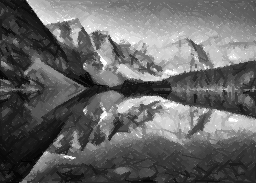

Work and research repository for drawing robot application development.

### TODO LIST ###

- :white_check_mark: Implement sequential colour version
- :white_check_mark: Implement parallel colour version 
- :white_check_mark: Implement vector graphics generation 
- :white_check_mark: Implement line version using semi-transparent representation
- :white_large_square: Implement continuous version for drawing in one stroke

### Example images ###
 All images used in this work identified by Pixabay, are free of known copyright restrictions.

 
 

* Konevi. (2018, May 26). Rose [Photograph]. Pixabay.
https://pixabay.com/images/id-3471111/

 
 

* StockSnap. (2013, August 5). Dog [Photograph]. Pixabay.
https://pixabay.com/images/id-2561134/

Version 3 

 

Version 1

 

 
 

* WikiImages. (2012, December 19). Charles Darwin [Photograph]. Pixabay.
https://pixabay.com/images/id-62967/

<table>
  <tr>
    <td>First Screen Page</td>
     <td>Holiday Mention</td>
     <td>Present day in purple and selected day in pink</td>
  </tr>
  <tr>
    <td valign="top"></td>
    <td valign="top"></td>
    <td valign="top"></td>
  </tr>
 </table>

* WikiImages. (2017, August 27). Moraine Lake [Photograph]. Pixabay.
https://pixabay.com/images/id-2686353/
