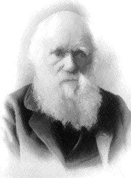

Work and research repository for drawing robot application development.

### TODO LIST ###

- :white_check_mark: Implement sequential colour version
- :white_check_mark: Implement parallel colour version 
- :white_check_mark: Implement vector graphics generation 
- :white_check_mark: Implement line version using semi-transparent representation
- :white_large_square: Implement continuous version for drawing in one stroke

### Example images ###
 All images used in this work identified by Pixabay, are free of known copyright restrictions.

* WikiImages. (2017, August 27). Moraine Lake [Photograph]. Pixabay.
https://pixabay.com/images/id-2686353/

* StockSnap. (2013, August 5). Dog [Photograph]. Pixabay.
https://pixabay.com/images/id-2561134/

* WikiImages. (2012, December 19). Charles Darwin [Photograph]. Pixabay.
https://pixabay.com/images/id-62967/

<table>
  <tr>
    <td>Drawing process</td>
     <td>Final drawing</td>
     <td>Original template</td>
  </tr>
  <tr>
    <td valign="center"></td>
    <td valign="center"></td>
    <td valign="center"></td>
  </tr>
  <tr>
    <td valign="center"></td>
    <td valign="center"></td>
    <td valign="center"></td>
  </tr>
  <tr>
    <td valign="center"></td>
    <td valign="center"></td>
    <td valign="center"></td>
  </tr>
 </table>

