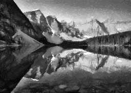
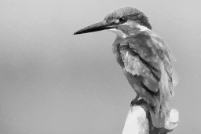

 [](https://opensource.org/licenses/MIT) 

### About :mag:
This repository is a supplementary material to the research article

<sub>-orange)</sub> [Fast robotic pencil drawing based on image evolution by means of genetic algorithm](https://www.sciencedirect.com/science/article/abs/pii/S0921889021001974) 

and presents a software solution for creating a pencil drawing robot based on image evolution.

### Video presentation :clapper: 

[](https://www.youtube.com/watch?v=rnuUgN182wo)

### Usage :computer:

The generated output is controlled by changing user parameters inside the `gen_drawing.py` startup script: 
```python
# ------------------------------ USER PARAMETERS --------------------------
img_str = "Darwin_enhanced.jpg"  # image to load (from ./images folder)
basewidth = 256 # output width of generated image 
deterministic_mode = True  # reproducible results [True, False]
generate_gif = True # generate animation [True, False]
deterministic_seed = 42 # seed for pseudo-random generator
N = 6000 # number of objects in created image
# --- Genetic Optimization ---
NEvo = 10 # number of evolution steps per one optimized object 
MAX_BUFF = 5  # stopping evolution if there are no changes (MAX_BUFF consecutive evolution steps)
MAX_ADDMUT = 5 # [%] - maximum aditive mutation range
MUT_RATE = 20 # [%] - mutation rate (percentage of chromosomes to be mutated)
LINE_WIDTH = 2 # [px] line width
MLTPL_EVO_PARAMS = 1 # parameter multiplier
BLEND_MODE = "darken" # available options: ["normal", "multiply", "screen", "overlay", "darken", "lighten", "color_dodge", "color_burn", "hard_light", "soft_light", "difference", "exclusion", "hue", "saturation", "color", "luminosity", "vivid_light", "pin_light", "linear_dodge", "subtract"]
# -------------------------------------------------------------------------
```

by default, input templates are loaded from the `./images` folder. The output is a generated image according to the specification in `.png` format, including data `.csv` file and optional `.gif` animation all stored in the `./results` folder. The csv file contains coordinates of the line segments endpoints x<sub>1</sub>, x<sub>2</sub>, y<sub>1</sub>, y<sub>2</sub>, the intensity of the pencil pressure (zero represent no pressure and coincides with the white shade on the canvas)  and value of the fitness function after drawing the corresponding line segment in the generated image.

Data `.csv` file header:
| <sup>x<sub>1</sub> \<0, image width-1\> </sup> | <sup>x<sub>2</sub> \<0, image width-1\> </sup> | <sup>y<sub>1</sub> \<0, image height\-1></sup> | <sup>y<sub>2</sub> \<0, image height-1\> </sup> | <sup>Pencil pressure \<0, 255\> </sup> | <sup>Fitness value</sup> |
|---|---|---|---|---|---|

### Results  :pencil2: 

<table>
  <tr>
    <td><strong><em>Image Evolution</em></strong></td>
     <td><strong><em>Final generated image</em></strong></td>
     <td><strong><em>Original template</em></strong></td>
  </tr>
  <tr>
    <td valign="center"></td>
    <td valign="center"></td>
    <td valign="center"></td>
  </tr>
  <tr>
    <td valign="center"></td>
    <td valign="center"></td>
    <td valign="center"></td>
  </tr>
  <tr>
    <td valign="center"></td>
    <td valign="center"></td>
    <td valign="center"></td>
  </tr>
  <tr>
    <td valign="center"></td>
    <td valign="center"></td>
    <td valign="center"></td>
  </tr>
 </table>
 

### Example images :camera:
[](https://opendatacommons.org/licenses/pddl/) All images used in this work identified by Pixabay, are free of known copyright restrictions.

* WikiImages. (2017, August 27). Moraine Lake [Photograph]. Pixabay.
https://pixabay.com/images/id-2686353/

* WikiImages. (2012, December 19). Charles Darwin [Photograph]. Pixabay.
https://pixabay.com/images/id-62967/

* StockSnap. (2013, August 5). Dog [Photograph]. Pixabay.
https://pixabay.com/images/id-2561134/

* David Mark. (2017, February 7). Kingfisher [Photograph]. Pixabay.
https://pixabay.com/images/id-2046453/

### Dependencies :dizzy:
The code was tested under `Python>=3.7` and uses these modules:

- numpy >= 1.18.5
- Pillow >= 7.2.0
- matplotlib >= 3.2.1
- image4layer >= 0.43.4

### Citing :books:
If you find this open source project useful, please reference in your paper:

    @article{adamik2021frpd,
      title={Fast robotic pencil drawing based on image evolution by means of genetic algorithm},
      author={Adamik, Michal and Goga, Jozef and Pavlovicova, Jarmila
              and Babinec, Andrej and Sekaj, Ivan},
      journal={Robotics and Autonomous Systems},
      year={2022},
      pages = {103912},
	  volume = {148},
      issn = {0921-8890},
      doi = {https://doi.org/10.1016/j.robot.2021.103912},
      url = {https://www.sciencedirect.com/science/article/pii/S0921889021001974}
    }

### Contact :envelope:
The research behind this work was conducted by:

[Michal Adamík](https://is.stuba.sk/lide/clovek.pl?id=64812;lang=en), [Jozef Goga](https://is.stuba.sk/lide/clovek.pl?id=47568;zalozka=1;lang=en;), [Jarmila Pavlovičová](https://is.stuba.sk/lide/clovek.pl?id=1872;zalozka=1;lang=en;), [Andrej Babinec](https://is.stuba.sk/lide/clovek.pl?id=11598;zalozka=1;lang=en;), [Ivan Sekaj](https://is.stuba.sk/lide/clovek.pl?id=4946;zalozka=1;lang=en;)

at 

[](https://www.fei.stuba.sk/english.html?page_id=793)

in collaboration with 

  [](http://nacero.sk/language/en/) &nbsp;&nbsp;&nbsp;&nbsp;&nbsp;&nbsp;&nbsp;&nbsp;&nbsp;&nbsp;&nbsp;&nbsp;&nbsp;&nbsp;&nbsp;&nbsp;&nbsp;&nbsp;&nbsp;  [](https://www.dih.stuba.sk) 
  &nbsp;&nbsp;&nbsp;&nbsp;&nbsp;&nbsp;&nbsp;&nbsp;&nbsp;&nbsp;&nbsp;&nbsp;&nbsp;&nbsp;&nbsp;&nbsp;&nbsp;&nbsp;&nbsp;  [](https://www.cvtisr.sk/en.html?page_id=58) 
  


